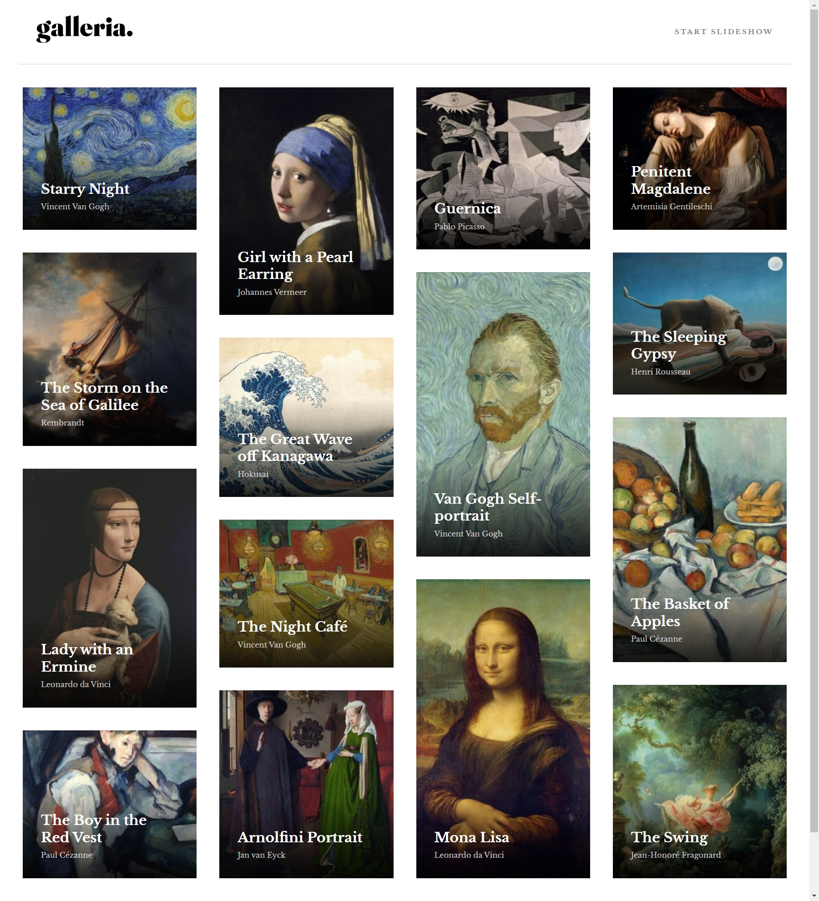

# Frontend Mentor - Galleria slideshow site solution

This is a solution to the [Galleria slideshow site challenge on Frontend Mentor](https://www.frontendmentor.io/challenges/galleria-slideshow-site-tEA4pwsa6).

## Table of contents

- [Overview](#overview)
  - [The challenge](#the-challenge)
  - [Screenshot](#screenshot)
  - [Links](#links)
- [My process](#my-process)
  - [Built with](#built-with)
  - [What I learned](#what-i-learned)
  - [Continued development](#continued-development)
  - [Useful resources](#useful-resources)
- [Author](#author)
- [Acknowledgments](#acknowledgments)

## Overview

### The challenge

Users should be able to:

- View the optimal layout for the app depending on their device's screen size
- See hover states for all interactive elements on the page
- Navigate the slideshow and view each painting in a lightbox

### Screenshot

### Links

- Solution URL: [GitHub repo](https://github.com/kaamiik/fm-Galleria-Slideshow-using-Astro-Sass-Tailwind)
- Live Site URL: [Vercel Live preview](https://fm-galleria-slideshow-using-astro-sass-tailwind.vercel.app/)

## My process

### Built with

- Semantic HTML5 markup
- CSS custom properties
- Flexbox
- CSS Grid
- Tailwind
- Sass/Scss
- Mobile-first workflow
- Vanilla JS
- BEM & CUBE CSS
- Astro dynamic routes

### What I learned

I've done this project with dynamic routes in astro to navigate between the painting pages. And also for the CSS I've used grid layout to build a masonry layout. I've also used Sass, Tailwind and custom properties.

## Author

- Frontend Mentor - [@kaamiik](https://www.frontendmentor.io/profile/kaamiik)
- X - [@kiaakamran](https://www.twitter.com/yourusername)
